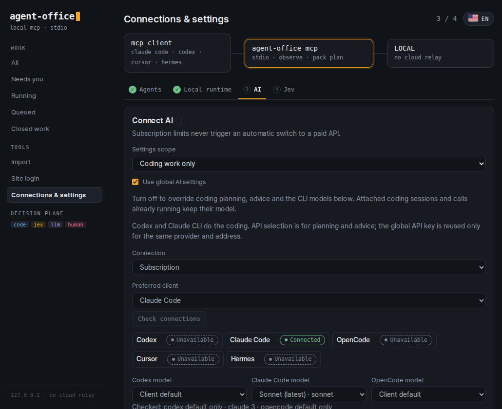

<div align="center">

# Agent Office

**AI 에이전트에 전용 브라우저·CLI·파일 작업 도구와 실행 기록·승인·복구 기능을 제공하는 로컬 MCP 런타임**

[English](README.md) · **한국어**

<sub>저장소·CLI 이름: <code>agent-driver</code></sub>

[](LICENSE)


</div>

**Claude Code, Codex, Cursor, OpenCode, Hermes**에 연결하면 웹 검색, 폼 입력, 파일 수집, 코딩 업무를 맡길 수 있습니다. 브라우저 작업은 사용자가 쓰는 브라우저가 아닌 별도 브라우저에서 진행합니다. 모든 단계는 로컬 SQLite에 기록되어 중단된 작업을 멈춘 곳에서 이어갈 수 있습니다. 사용자의 마우스나 열린 탭은 건드리지 않습니다.

> **v0.2.0 지원 범위:** Ubuntu 24.04 x86_64, Windows 11 + WSL2 Ubuntu 24.04. 기능별 검증 근거와 실험 기능의 제약은 [출시 검증 기록](docs/release-readiness-v0.2.0.md)에 있습니다.

> **v0.2.0:** Hermes 업무 가져오기, 실행 서버를 유지하는 원격 OpenClaw 관리, 코딩 전용 모델 설정이 추가되었습니다. 프로젝트 가져오기는 코드 근거가 있는 Jev 개선 지점을 최대 한 곳 추천하며, Jev 없이도 사용할 수 있습니다. [변경 내역](docs/releases/v0.2.0.md).

**업무 현황 → 가져오기**에서 프롬프트 붙여넣기, 로컬 프로젝트, [Hermes 업무](docs/work-migration.md), [원격 OpenClaw](docs/remote-office.md)를 선택합니다. 내용을 확인하고 연결하며, 가져오기만으로 실행하거나 예약을 켜지 않습니다. Hermes는 호환 로컬 설치가, 원격 OpenClaw는 Office가 실행되는 환경의 SSH 연결이 필요합니다. 원격 업무의 실행 서버는 그대로 유지합니다.

코딩 전용 모델은 **연결 및 설정 → AI → 코딩 업무 전용**에서 선택합니다. 기본값은 전역 설정 상속입니다. [모델 설정](docs/control-settings.md) · [업무 인계](docs/continuity-and-execution-ownership.md) · [선택적 Jev 추천](docs/jev-import-recommendation.md).

---

## 목차

- [빠른 시작](#빠른-시작)
- [관제센터 단계별 안내](#관제센터-단계별-안내)
- [준비된 기능](#준비된-기능)
- [Meta Muse·Grok Bot과 무엇이 다른가요?](#meta-musegrok-bot과-무엇이-다른가요)
- [실행 방식](#실행-방식)
- [지원 범위와 제약](#지원-범위와-제약)
- [개발](#개발) · [라이선스](#라이선스)

---

## 빠른 시작

### 방법 A: 에이전트에게 맡기기

Claude Code, Codex 같은 에이전트에 다음과 같이 요청하세요.

> github.com/deepdivekr/agent-driver를 설치하고 MCP에 연결해줘. 앞으로 브라우저와 파일 작업에 Agent Office를 사용해줘.

### 방법 B: 명령 한 줄

Ubuntu 또는 WSL2 Ubuntu 터미널에서 한 번 실행합니다.

```bash
bash -o pipefail -c 'curl -fsSL https://raw.githubusercontent.com/deepdivekr/agent-driver/v0.2.0/install.sh | bash'
```

아래는 같은 설치 단계를 거치는 **v0.1.0 당시**의 Ubuntu 24.04 x86_64 설치 화면입니다. 당시 **16초**, 종료 코드 0을 기록했으며 v0.2.0의 소요 시간 측정은 아닙니다.


<sub>2026-09-24 캡처. 출력에서 두 곳을 손봤습니다. git의 detached HEAD 안내 14줄은 접었고, 관제센터 URL의 capability token은 가렸습니다. 캡처한 머신의 네트워크가 Playwright CDN을 막고 있어서 `PLAYWRIGHT_BROWSERS_PATH`로 이미 설치된 Chromium을 지정했습니다. 일반 환경에서는 `전용 Chromium 준비` 단계에서 Chromium을 내려받으므로 시간이 더 걸립니다.</sub>

**설치기가 하는 일**

| 단계 | 내용 |
|---|---|
| Node.js **22.22.0** | 공식 배포물을 내려받아 SHA-256 checksum을 확인합니다. 시스템 Node는 건드리지 않습니다. |
| npm **11.11.0**, 의존성, 빌드 | `package-lock.json`에 고정된 버전을 사용합니다. |
| 전용 Playwright Chromium | Chromium을 실제로 한 번 실행해 확인합니다. Ubuntu/WSL 시스템 라이브러리가 부족하면 설치를 멈추고 해결 명령을 안내합니다. |
| `agent-driver` 명령 | `~/.local/bin/agent-driver`에 설치합니다. |
| 관제센터 | `127.0.0.1`에 일회용 capability URL로 시작하고, 가능한 환경에서는 브라우저로 엽니다. |

설치기는 `sudo`를 실행하거나 시스템 패키지를 설치하지 않습니다. 비관리 폴더, 심볼릭 링크, 수정된 설치본은 덮어쓰지 않습니다. 실행 전에 스크립트를 검토하려면 [install.sh](install.sh)를 먼저 내려받아 확인하세요.

### 기존 설치 업데이트

진행 중인 업무를 마치고 Agent Driver MCP 연결과 관제센터 프로세스를 종료한 뒤, 위 명령을 다시 실행합니다. 설치기가 관리하는 소스 폴더만 갱신하며 `~/.agent-driver`의 설정과 업무 기록은 유지합니다. 설치 후 MCP를 다시 연결해야 새 코드가 적용됩니다. 실행 중인 프로세스를 자동으로 바꾸거나 강제 종료하지는 않습니다.

### 연결 확인

관제센터에서 MCP를 등록하면(아래 1단계) 클라이언트에서 바로 확인됩니다.


### 수동 MCP 등록

관제센터가 자동으로 등록할 수 없는 클라이언트에서는 아래 설정을 사용합니다.

```text
agent-driver mcp
```

```json
{
  "mcpServers": {
    "agent-driver": {
      "command": "agent-driver",
      "args": ["mcp"]
    }
  }
}
```

이 설정은 클라이언트와 서버가 같은 Ubuntu/WSL 환경에서 실행될 때 사용합니다. **Windows 앱**에서는 관제센터가 표시하는 `wsl.exe --distribution ... --exec ... mcp` 명령을 사용하세요. Windows 앱이 WSL 안의 서버를 시작하는 방식이며, native Windows 실행이 아닙니다.

[첫 연결 안내](docs/first-run.md) · [MCP 설정과 도구](docs/agent-interface.md) · [Hermes·Telegram 연결](docs/hermes-telegram-runtime.md)

---

## 관제센터 단계별 안내

설치기가 자동으로 실행하는 `agent-driver connect`가 **Agent Office 관제센터**를 엽니다. 관제센터는 agent-driver run trace와 같은 디자인 언어를 씁니다. 어두운 바탕에 mono 중심 라벨을 쓰고, 판단 경로마다 색이 하나씩 정해져 있습니다. **앰버**는 Jev와 지금 진행 중인 단계, **라일락**은 LLM, **파랑**은 코드, **로즈**는 사람, **초록**은 검증 완료입니다. 화면은 **영어가 기본**이고, 우측 상단의 국기 버튼을 누르면 한국어로 바뀝니다. 선택한 언어는 브라우저마다 기억됩니다. 프리텐다드 가변 글꼴 하나를 로컬에서 불러오며, 외부 글꼴 CDN·UI 프레임워크·화면 미리보기는 사용하지 않습니다. 선택 상태는 좌측 색띠 대신 테두리와 배경색으로 구분하고, 긴 설명은 **?** 버튼을 누르면 열립니다.

> 아래 화면은 모두 **v0.2.0 실제 관제센터**입니다. 2026-09-26에 위 터미널 실행과 같은 Ubuntu 24.04 머신에서 빈 `~/.agent-driver`부터 순서대로 캡처했고, 업무 상세의 업무는 그 머신의 구독 로그인으로 Claude Code가 실제로 정의한 것입니다. 영어 화면이 기본이고, 한국어 화면은 맨 아래에 있습니다.

### 설정 1/4: 에이전트

위쪽 흐름도는 관제센터의 위치를 보여줍니다. **mcp client → agent-office mcp → LOCAL** 순서이고, 클라우드 중계는 거치지 않습니다. 클라이언트마다 한 줄씩 상태 배지가 붙습니다.

- **초록**: 준비됨
- **로즈**: 조치 필요
- **회색 점선**: 미설치

지금 할 수 있는 동작은 줄마다 하나씩만 보여줍니다. 설치되지 않은 클라이언트에는 **공식 설치 프로그램**과 공식 안내 링크가 나옵니다. 이 머신에는 Claude Code가 이미 로그인돼 있어서 **Register MCP in Claude Code**를 한 번만 누르면 됐습니다.

| 등록 전 | 한 번 누른 뒤 |
|---|---|
|  |  |

끝난 단계는 탭에 ✓가 붙습니다. 하단의 **Setup log**는 접힌 채로 마지막 한 줄만 보여줍니다(예: `Claude Code MCP registered · 0.4s`). 터미널 원문과 인증 정보는 저장하지 않습니다.

### 2/4: 로컬 실행

전용 작업 폴더와 로컬 실행 권한을 한 번 승인합니다. **비간섭 모드**라서 사용자의 마우스나 열어 둔 Chrome 탭은 건드리지 않습니다.


### 3/4: AI

로그인된 구독이나 API 키 중 하나를 고릅니다. 클라이언트 상태는 작은 칩으로 표시되고, Claude Code 모델 목록(Sonnet, Opus, Haiku)은 CLI에서 불러옵니다.

Claude Code는 CLI가 `claude login` 세션이나 `claude setup-token` 장기 토큰을 보고하고, API 키 없이 Anthropic 자체 API를 쓸 때 구독으로 인정됩니다. API 키, `apiKeyHelper`, Bedrock·Vertex 로그인은 구독으로 보지 않으므로 실수로 과금되지 않습니다. 캡처한 머신은 `setup-token` 토큰을 씁니다.


**업무 내용을 AI로 보내려면 명시적인 동의가 한 번 필요합니다.** 체크박스를 켜고 저장하면 로컬 `~/.agent-driver/runtime-config.json`에 기록됩니다.

```json
{
  "schema_version": 1,
  "project_id": "agent-driver-local",
  "...": "다른 호스트 설정은 그대로 유지",
  "work": { "model_data_approved": true, "approved_at": "2026-09-24T21:13:56.611Z" }
}
```

이 값은 호출할 때마다 새로 읽기 때문에, 실행 중인 MCP 서버도 재시작 없이 바로 반영합니다. 설정 fingerprint에는 포함하지 않으므로, 켜고 끄더라도 진행 중인 실행이 무효가 되지 않습니다. 끄면 한 줄 업무는 저장되지만 **AI connection needed** 상태에서 멈추고, 상세 화면에 **Allow AI and retry** 버튼이 나타납니다.

**API 모드는 가능한 경우 작은 빠른 모델을 제안하며, 저장한 선택은 유지합니다.** 공급자를 바꾸면 해당 공급자의 목록을 다시 불러옵니다.

| 공급자 | 실시간 목록 확인 전 초기 제안 |
|---|---|
| OpenAI | `gpt-6-luna` |
| Anthropic | `claude-haiku-4-5` |
| OpenRouter | `openai/gpt-6-luna` |
| OpenAI 호환 서버 | 서버의 모델을 직접 선택하거나 ID 입력 |

새로고침은 목록을 갱신하며 사용자가 선택한 모델을 임의로 바꾸지 않습니다. 내장 초기 제안이 실제 목록에 없으면 사용 가능한 빠른 모델을 제안할 수 있습니다. 적합한 제안이 없으면 사용자가 선택하며, 목록의 첫 모델을 임의로 고르지 않습니다. 키는 연결 확인을 통과해야 저장되고, 구독에서 API 과금으로 자동 전환하지 않습니다. [인계 범위](docs/client-handoff.md)

| API 모드: Anthropic → `claude-haiku-4-5` | 설명은 모달로 |
|---|---|
|  |  |

**코딩 업무는 별도 모델을 쓸 수 있습니다.** **Settings scope**를 **Coding work only**로 바꿉니다. **Use global AI settings**가 켜져 있으면 전역 설정을 따르고, 끄면 코딩 계획·조언용 연결과 CLI 모델을 따로 고릅니다. 실제 코드 작업은 여전히 Codex·Claude CLI가 하며, 이미 연결된 세션은 기존 모델을 유지합니다.



### 4/4: Jev (선택)

어떤 요소를 클릭할지, 결과가 맞는지 같은 짧고 반복되는 판단을 빠르게 처리합니다. 키가 없으면 LLM이 대신 판단합니다.

Jev를 호출할 지점과 조건은 Task Pack에 있습니다. 신규 Work는 전역 연결 설정이 허용하는
범위에서 이를 사용하며, Work를 설계하는 LLM이 별도의 Jev ON/OFF 정책을 만들지 않습니다.
사용자가 개별 업무에서 명시적으로 끈 설정은 유지합니다.


### ① 업무: 보드와 목록

**Done**을 누르면 **Work** 화면이 열립니다. 모든 업무를 run trace와 같은 색으로 묶어 보여줍니다.

- **Needs you** (로즈)
- **Running** (앰버)
- **Queued** (회색)
- **종료된 업무** (실행 완료·사용자 중단을 각 상태 배지로 구분)

사이드바에는 그룹별 개수가 표시됩니다. 한 줄로 업무를 쓰고 **Submit**을 누르세요. 결과를 바꾸는 조건을 먼저 답하려면 **Guided**를 체크합니다. 보드에는 pack family와 Work ID가 적힌 카드가 나오고, **List**로 바꾸면 한 줄짜리 행으로 봅니다. 검색은 입력하는 대로 바로 걸러집니다. 실행이 끝났다는 사실만으로 업무의 모든 완료 조건을 검증했다고 표시하지 않습니다.

| 보드 | 목록 |
|---|---|
|  |  |

### ② 업무 상세: run trace

업무를 열면 run-trace 스토리보드와 같은 구성이 나옵니다.

- 상태 배지, Work ID, 현재 실행이 있으면 그 Run ID
- 커서가 깜박이는 요청 줄
- pack pill과 영향 범위(`research.search · read-only`)

이 예시에서는 한 줄 요청을 Claude Code가 정의해 제목과 완료 조건 3개를 만들었습니다. 머리글에는 Work ID(`#3C8CA8CA`)와, 따로 아직 실행이 시작되지 않았다는 표시가 있습니다. 왼쪽 **Run trace**에는 완료 조건마다 노드가 있고 담당이 함께 표시됩니다. 단계별 검증 진행을 독립적으로 보고하지 않는 실행 경로는 진행 막대 대신 **No per-stage verification**이라고 표시합니다. 검증된 단계는 앰버, 진행 중인 단계는 후광, 사람을 기다리는 단계는 로즈로 표시됩니다. 사진의 조건은 모두 대기 중이므로 완료·검증 사례가 아니라 화면 구성 예시입니다.


### ③ Human control: 멈추거나 방향 바꾸기

로즈 테두리의 **Human control** 패널에서 사람이 개입합니다. 할 수 있는 일은 다음과 같습니다.

- 다음 배정 일시정지
- 아직 시작하지 않은 단계를 눌러 새 지침 넣기(**Apply to next assignment**)
- 심화 업무의 조건 선택
- 정의 재시도
- 기존 Codex 세션을 이어받아 지시를 하나씩 보내기
- 비용 동의 후 이 업무에서 Jev 켜기, 또는 Task Pack이 Jev를 쓰는 업무에서 이 업무만 끄기
- 실행 이력과 클라이언트 인계 확인

이미 검증된 결과는 다시 쓰지 않습니다. 중간에 안전하게 바꿀 수 없는 실행 경로라면, 멈춘 척하지 않고 그 사실을 그대로 알려줍니다.

### 기존 업무 가져오기

**Import**에서는 다른 곳에서 만든 자동화를 옮겨 옵니다.

| 방법 | 설명 |
|---|---|
| **Another AI's automation** | 제공되는 프롬프트를 기존 AI에 붙여넣고, 받은 JSON을 다시 넣습니다. 결과는 **검증 전 초안**으로 다루며, 비밀값은 거부하고 주장마다 근거를 연결합니다. 기존 자동화는 바꾸지 않습니다. |
| **Workflow project** | 로컬·WSL 프로젝트 경로의 일부를 읽기 전용으로 분석합니다. 코드는 실행하지 않습니다. |
| **Improve an existing bot** | 기존 봇을 출발점으로 개선안을 만듭니다. |
| **Hermes 업무** | 호환 로컬 Hermes 프로필의 대화·예약을 찾아 보여줍니다. 초안을 확인한 뒤 가져오며, 실행은 같은 Hermes 프로필이 계속 맡습니다. 가져오기만으로는 모델 호출도 실행도 일어나지 않습니다. [자세히](docs/work-migration.md) |
| **원격 OpenClaw** | Office가 실행되는 환경의 SSH 키로, OpenClaw가 이미 돌고 있는 서버의 대화·예약을 찾습니다. OpenClaw는 그 서버에 그대로 있고, 다음 지시는 업무 상세에서 보냅니다. 연결만으로는 아무것도 실행하지 않습니다. [자세히](docs/remote-office.md) |


### 사이트 로그인 (필요할 때만)

사이트 로그인은 첫 설정에 포함되지 않습니다. 업무가 로그인이 필요한 URL을 만나면 그 worker만 멈추고, 해당 사이트가 이 화면에 나타납니다. 아래 사진은 로그인 필요 사이트가 없는 빈 상태만 보여주며, 실제 로그인·인계 검증 장면은 아닙니다.


### 한국어 화면과 모바일

| 한국어 (국기 버튼) | 모바일 390px |
|---|---|
|  |  |

---

## 준비된 기능

### Task Pack

Task Pack은 작업의 입력, 실행 순서, 결과 확인 방법을 묶은 단위입니다. v0.2.0에는 아홉 가지 Pack family가 있습니다.

| 작업 | 예시 | Pack family |
|---|---|---|
| 검색·비교 | 여러 출처를 조사하고 근거 링크와 함께 정리 | `research.search` |
| 조회·다운로드 | 로그인된 포털에서 기간별 자료 수집 | `portal.collect` |
| 폼 작성 | 신청서 초안을 채우고 제출 전 검토 | `form.draft-submit` |
| 정보 수정 | 기존 레코드를 읽고 승인받은 내용 반영 | `record.update` |
| 후보 선택 | 상품·옵션을 비교하고 장바구니에 담기 | `choose.stage` |
| 받은 편지 정리 | 메시지 분류와 답장 초안 작성 | `inbox.triage` |
| 변경 감시 | 가격·상태를 반복 확인하고 변경 기록 | `monitor.watch` |
| 파일 처리 | CSV·JSON 필터링, 변환, 병합 | `file.pipeline` |
| 코딩 업무 | 로컬 Git 프로젝트에서 Codex 구현·Claude 검토·문서 인계. GitHub 불필요 | `coding.orchestrate` (실험적) |

사이트마다 로그인과 실행 설정이 필요합니다. 검증된 작업 흐름은 다음 실행에서 재사용합니다. 새 사이트에 자동으로 적응하는 기능은 실험 중입니다. [Pack 목록과 지원 범위](docs/pack-catalog.md)

### MCP 도구 (`agent-driver mcp`가 제공하는 74개)

위에서 설치한 환경에 실제로 `tools/list`를 호출해 센 결과입니다.

| 영역 | 도구 | 에이전트가 할 수 있는 일 |
|---|---|---|
| **업무(Work)** | `runtime_work_*` (10) | 한 줄 업무 접수·정의, 확인 질문 답변, 일시정지, 다른 AI·프로젝트의 업무 가져오기 |
| **Pack** | `runtime_pack_*` (8) | 자연어로 계획, 실행, 승인된 스냅샷 1회 실행, 감시 실행, 이벤트 읽기 |
| **Swarm** | `runtime_swarm_*` (10) | 병렬 worker 계획, lease 배정, worker별 전용 브라우저 할당, 활동 보고, 복구 |
| **코딩** | `runtime_coding_*` (13) | 등록된 Git 프로젝트에서 Codex·Claude 단계 계획과 실행, 기존 Codex 세션 연결, 중단 후 정합성 확인 |
| **터미널** | `runtime_terminal_*` (11) | 지속형 CLI 세션 시작·입력·재개·중단, 출력 읽기, 인계, 검증, 파일 정합성 확인 |
| **Task·복구** | `runtime_task_*`, `runtime_recovery_*` (7) | 작업 접수, 시작·취소·재개, generation 확인을 거친 복구 준비 |
| **운영** | health, storage, events, artifacts, capabilities, decision, channel, activity (13) | 상태·저장소 확인과 정리, 이벤트 읽기·확인, 결과물 목록, 활동 보고, Decision Plane 상태 확인 |

`runtime_browser_session_open`과 `runtime_browser_session_status`는 v0.2.0에서도 자리만 있는 도구입니다. 호출하면 "미구현" 오류를 반환합니다.

### 코딩 업무

연결된 에이전트에게 *"이 프로젝트의 마지막으로 중단된 업무를 이어서 진행해줘"* 라고 요청할 수 있습니다. 등록한 Git 프로젝트와 로그인된 CLI만 사용하고, 단계마다 실행 기록을 남깁니다. 쓰기와 README 로컬 커밋은 프로젝트별 허용 범위가 필요합니다. 푸시나 배포는 하지 않습니다. [설정과 제약](docs/coding-orchestration.md)

### 실제 실행 기록

- **Pack family를 stdio MCP로 끝까지 실행:** 공개 뉴스 수집 → 로컬 검색·CSV → Jev 분류 → 감시 상태 재연결 → 실제 연락 양식 초안 작성(**미제출**). 6종 경로를 원본에서 6.743초, 공개 alpha.18 사본에서 10.959초에 확인했습니다. 서로 다른 실행이며 속도 비교가 아닙니다. [단계별 결과](docs/evaluation-live-alpha-18.md)
- **Swarm:** 6개 사이트를 다시 관측하고, 종합 단계의 시간 초과를 복구해 3분 43.8초에 조사 메모를 완성했습니다. [실패와 복구, worker별 시간·토큰](docs/evaluation-swarm-alpha-18.md)

---

## Meta Muse·Grok Bot과 무엇이 다른가요?

세 제품 모두 AI 에이전트에게 "컴퓨터"를 줍니다. 차이는 **컴퓨터를 누가 소유하는지**와 **어디서 에이전트와 대화하는지**에 있습니다.

- **[Meta Muse](https://about.fb.com/news/2026/09/introducing-muse-personal-ai-agent/)** 는 사람마다 *Muse Secure VM*을 두고 그 안에 에이전트와 데이터를 둡니다. Muse 앱이나 WhatsApp으로 일을 맡기고, 앱을 닫아도 계속 실행됩니다. 선호를 기억하고, 이메일 전송이나 구매 전에는 승인을 받습니다. 결제 보호를 포함한 agent checkout도 제공합니다.
- **[Grok Bot](https://x.ai/news/introducing-grok-bot)** 은 bot마다 클라우드 컴퓨터를 주고, 웹·앱·받은편지함에서 24시간 일합니다. 데스크톱과 휴대전화에서 메시지로 맡깁니다. 상위 bot이 조정하고 bot끼리 thread context를 공유하는 팀 구성도 지원합니다.
- **Agent Office** 는 **실행 계층만** 담당하며 **사용자의 머신**에서 실행됩니다. 자체 채팅 앱은 없습니다. 쓰던 Claude Code, Codex, Cursor, OpenCode, Hermes/Telegram을 그대로 쓰고, 모두 MCP로 같은 런타임을 공유합니다.

| | Meta Muse / Grok Bot | **Agent Office** |
|---|---|---|
| 형태 | 완성형 제품: 공급자 앱 + 클라우드 컴퓨터 | 사용자가 설치하는 로컬 MCP 런타임 |
| 작업 입구 | 제품 자체 채팅, 모바일 앱, 메신저 | 모든 MCP 클라이언트(Claude Code, Codex, Cursor, OpenCode, Hermes/Telegram)와 로컬 관제센터 |
| 컴퓨터 | 공급자가 운영하는 사람별·bot별 상시 클라우드 VM | 사용자의 Linux/WSL 호스트와 전용 브라우저. Ubuntu VM은 선택 |
| PC가 꺼져도 실행 | 됨 (공급자 클라우드에서 실행) | **안 됨.** 호스트가 켜져 있어야 합니다. 클라우드 worker는 아직 제공하지 않습니다. |
| 기억·개인화 | 대화·선호·목표 기억을 제품이 제공 | 대화 기억은 클라이언트가 소유. 런타임은 task·근거·복구 상태를 보존 |
| 다중 에이전트 | 제품이 bot 팀을 운영 | Swarm이 worker lease·병렬 배정·활동을 관리. sub-agent는 클라이언트가 실행 |
| 실행 방식 | 화면 조작 중심. API가 없는 앱까지 포괄 | Playwright 브라우저·CLI·파일 실행기. Decision Plane이 판단마다 LLM·Jev·코드 중 하나를 선택 |
| 승인 | 메일·구매 등에서 제품 승인 흐름 | 효과별 승인, lease, 재확인, 중복 효과 방지 |
| 결제 | Muse는 agent checkout 포함 | **지원 범위 밖:** 결제·주문·예약 확정 없음 |
| 데이터 경계 | 공급자의 보안·개인정보 모델에 의존 | 로컬 저장과 전용 프로필·VM. 실행 환경과 데이터를 사용자가 소유 |
| 클라이언트 전환 | 해당 제품에 고정 | 연결한 모든 클라이언트에서 같은 작업·Pack·기록을 이어감 |
| 라이선스 | 상용 서비스 | Apache-2.0 오픈소스 |

**Muse나 Grok Bot이 맞는 경우:** 채팅, 기억, 알림까지 갖춘 상시 비서를 다른 곳에서 운영해 주기를 원할 때.
**Agent Office가 맞는 경우:** 이미 코딩 에이전트나 CLI로 일하고 있고, 그 도구들이 **로컬에서 복구 가능하고 감사할 수 있는** 실행 계층 하나를 공유하기를 원할 때. 이 계층은 사용자가 소유합니다.

출처와 상세 내용: [제품 비교 (2026-09-23)](docs/product-comparison-2026-09-23.md)

---

## 실행 방식

```
 Claude Code / Codex / Cursor / OpenCode / Hermes
                    │  MCP (stdio)
                    ▼
            agent-driver mcp  ──►  관제센터 (127.0.0.1)
                    │
   ┌────────────────┼──────────────────┐
   ▼                ▼                  ▼
 전용 Chromium    CLI 세션          허용된
 / 선택형 VM      (PTY)             파일 경로
                    │
                    ▼
       로컬 SQLite: 작업 · 근거 · 복구
```

클라이언트가 `agent-driver mcp`를 로컬 프로세스로 시작하고 작업을 보냅니다. Agent Office는 전용 브라우저, CLI 세션, 허용된 파일 경로에서 작업을 실행한 뒤 **결과를 다시 읽어 확인**하고, 복구를 위해 상태를 로컬 SQLite에 저장합니다.

| 역할 | 담당 |
|---|---|
| **LLM** | 요청 해석, 작업 계획, 처음 보는 상황 처리 |
| **Jev** (선택) | 화면 상태, 클릭 대상, 결과 품질, 다음 단계 판단 |
| **코드** | 클릭·입력·파일 처리, 승인 검사, 실행 결과 확인 |

Jev는 현재 상태와 후보를 받아 선택 결과와 확률을 돌려줍니다. 판단 종류별 검증 기준을 통과한 결과만 실행에 쓰고, 불확실하면 LLM이 다시 검토합니다. 모델에 보내는 관측 정보는 연결한 제공자의 API로 전송됩니다.

**Swarm 모드:** LLM이 작업을 나누고 클라이언트가 여러 sub-agent를 병렬로 실행합니다. Agent Office는 작업 배정, 진행 상태, 결과 검증을 관리합니다. sub-agent 실행을 지원하는 클라이언트가 필요합니다.

[Swarm Mode](docs/swarm-mode.md) · [Jev 판단과 검증](docs/decision-plane.md) · [평가 결과](docs/evaluation-summary.md) · [관제센터](docs/control-center.md)

---

## 지원 범위와 제약

- **지원 환경:** Ubuntu 24.04 x86_64, Windows 11 + WSL2 Ubuntu 24.04. Native Windows·macOS 설치와 데스크톱 앱 제어는 지원하지 않습니다.
- **브라우저:** Playwright Chromium을 사용합니다. 선택형 Ubuntu VM은 KVM·QEMU가 필요하며, VM 안에서 사이트에 따로 로그인합니다.
- **외부 변경:** 폼 제출과 레코드 수정은 변경 내용을 확인한 사람의 승인이 필요합니다.
- **작업 한도:** 상품은 장바구니, 메시지는 초안까지입니다. 결제, 예약 확정, 주문, 멤버십 가입, 이메일 발송, 삭제는 지원 범위 밖입니다.
- **격리:** 전용 브라우저와 VM은 작업을 사용자의 브라우징과 분리합니다. 악성 코드를 막는 보안 샌드박스로는 검증하지 않았습니다.
- **개인 계정:** 필요하면 전용 브라우저 프로필을 사용할 수 있습니다. 사이트별 이용 조건과 접근 방식은 사용자가 정하며, Agent Office가 특정 API를 강제하지 않습니다.
- **관제센터:** 영어가 기본이고, 국기 버튼으로 한국어로 바꿀 수 있습니다. Agent Office에 보고된 작업만 표시하며, 클라이언트가 직접 한 일을 엿보지 않습니다.

[Ubuntu VM 설정](docs/owned-ubuntu-browser-vm.md) · [CLI 지원 범위](docs/cli-adapter-matrix.md) · [복구 절차](docs/supervisor-recovery.md)

---

## 개발

저장소 루트의 Ubuntu/WSL 터미널에서 실행합니다.

```bash
npm ci
npm run test:runtime
```

`test:runtime`은 빠른 기본 회귀 테스트이며 장시간 soak 테스트는 포함하지 않습니다. 선택 테스트는 따로 실행합니다.

```bash
# 장시간 soak만 실행
npm run build && node scripts/runtime/run-tests.mjs soak
# soak를 포함한 전체 묶음
npm run build && node scripts/runtime/run-tests.mjs full
```

테스트 결과에는 각 검사가 실제 환경에서 실행됐는지, 테스트용 환경에서 실행됐는지가 기록됩니다. 설계와 세부 계약은 [개발 문서](docs/control-plane-design-v0.7.md)를 참고하세요.

## 라이선스

[Apache License 2.0](LICENSE). 조건에 따라 수정, 재배포, 상업적 사용이 가능합니다. 외부 의존성은 각자의 라이선스를 따릅니다. [라이선스 범위](docs/licensing.md) · [외부 의존성 고지](THIRD_PARTY_NOTICES.md)
