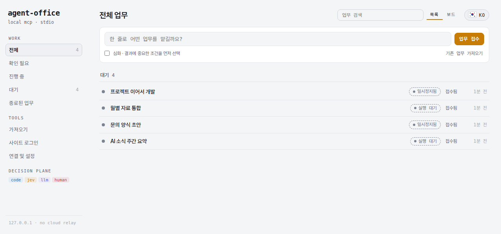
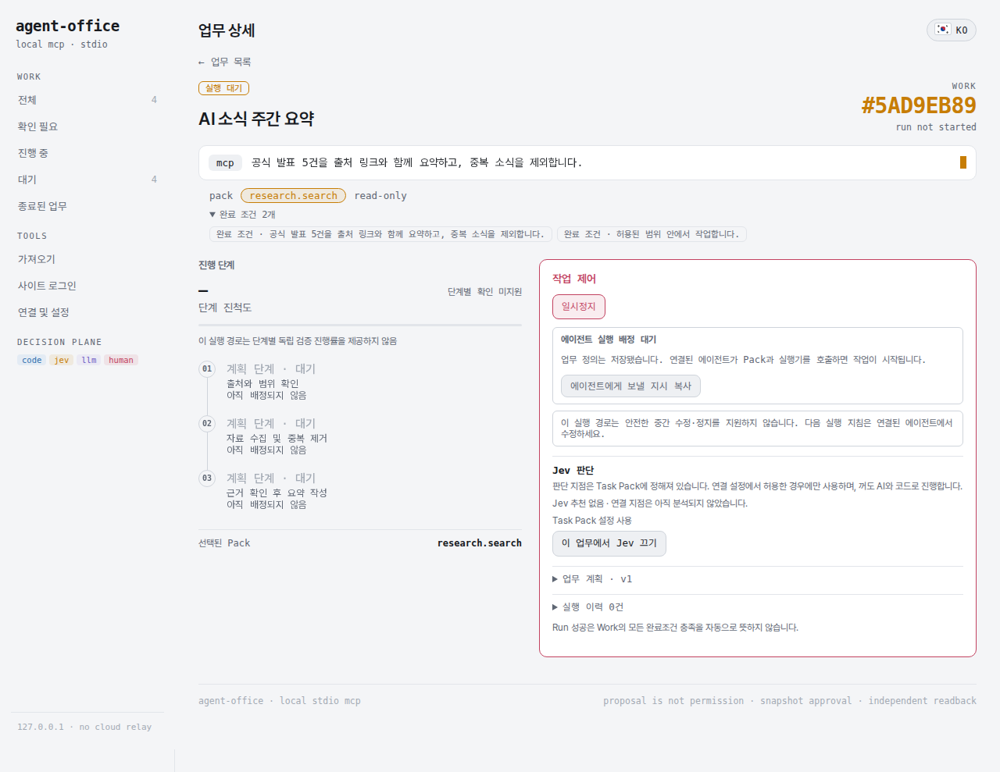
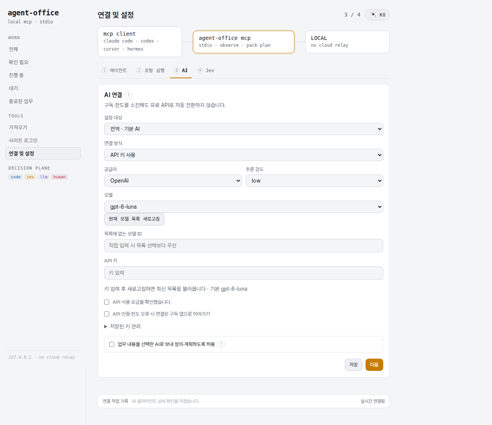

# Agent Office

**AI 에이전트가 내 컴퓨터에서 업무를 실행하고, 중단된 지점부터 이어가게 하는 로컬 MCP 서버입니다.**

[English](README.md) · **한국어** · [v0.3.1 변경 내역](docs/releases/v0.3.1.md)

Codex, Claude Code, Cursor, OpenCode, Hermes 등 MCP 클라이언트에 연결합니다.
저장소와 기본 명령은 `agent-office`입니다. 이전 `agent-driver` 명령은 호환용 별칭으로 남깁니다.

## 화면으로 보기

**업무 목록** — 한 줄로 업무를 맡기고, 현재 상태와 확인할 일을 모아 봅니다.



<details>
<summary>업무 상세와 AI 연결 화면 보기</summary>

**업무 상세** — 목표·완료 조건·계획 단계와 실행 배정 상태를 확인하고, 실행 전에 일시정지합니다.



**AI 연결** — 구독 클라이언트·API·호환 로컬 모델 중 사용할 연결을 선택합니다.



</details>

v0.3.1 실제 화면에 공개용 예시 업무를 넣어 촬영했습니다.
설정과 실행 대기 상태를 보여주며, 실제 에이전트 실행 성과를 뜻하지 않습니다.

## 지원 환경

| 환경 | 상태 |
|---|---|
| Ubuntu 24.04 x86_64 | 브라우저·CLI·파일 업무 지원 |
| Windows 11 + WSL2 Ubuntu 24.04 | 같은 Linux 런타임 사용 |
| Windows 네이티브 앱 제어 | 실험 기능. 별도 실행기·권한 설정 필요 |
| macOS | 설치·실환경 검증 미완료 |

기본 브라우저는 전용 백그라운드 Chromium입니다. VM은 선택 사항입니다.
모든 데스크톱 앱을 설치 직후 제어하는 제품은 아직 아닙니다.

## 시작하기

에이전트에게 이렇게 요청하세요.

> github.com/deepdivekr/agent-office를 설치하고 MCP로 연결해줘. 앞으로 브라우저·파일 업무에 Agent Office를 사용해줘.

직접 설치하려면 **Ubuntu 또는 WSL Ubuntu 터미널**에서 실행합니다. 작업 폴더와 무관합니다.

```bash
bash -o pipefail -c 'curl -fsSL https://raw.githubusercontent.com/deepdivekr/agent-office/v0.3.1/install.sh | bash'
```

설치 전에 [스크립트](install.sh)를 확인할 수 있습니다.
설치기는 전용 Node.js·의존성·Chromium을 준비하고 관제센터를 엽니다.
시스템 라이브러리가 부족하면 필요한 명령을 안내하며, 관리자 권한을 자동 사용하지 않습니다.

### 관제센터에서 연결

1. **클라이언트 연결** — 설치·로그인을 확인하고 MCP를 등록합니다.
2. **실행 환경** — 기본 브라우저를 사용하거나 선택 실행기를 연결합니다.
3. **AI 연결** — 구독 CLI 또는 API를 선택합니다. 호환 로컬 모델도 연결할 수 있습니다.
4. **첫 업무** — 한 줄로 요청하고 진행 상황을 확인합니다.

Jev는 선택 사항입니다. 연결하지 않아도 LLM과 코드로 진행합니다.
사이트 로그인은 해당 업무에서 필요할 때 요청합니다.

Aside·Neo는 별도 설치와 실행이 필요합니다. 관제센터에서 연결 상태를 확인하고 등록합니다.
연결하지 않으면 기본 Playwright를 사용합니다.
자동 전환은 허용된 환경 안에서만 이루어집니다. [실행기 연결 안내](docs/browser-executor-setup.md)

이후 관제센터를 다시 열려면 같은 Ubuntu 환경에서 실행하세요.

```bash
~/.local/bin/agent-office connect
```

수동 MCP 등록 명령은 `agent-office mcp`입니다.
Windows 앱에는 관제센터가 표시하는 WSL 연결 명령을 사용합니다.
[자세한 첫 실행 안내](docs/first-run.md) · [MCP 설정](docs/agent-interface.md)

## 어떤 업무를 맡기나요?

> 세 회사의 공식 발표를 조사해서 출처가 있는 비교표를 만들어줘.

> 이 문의 양식을 작성해줘. 제출 전에는 멈춰줘.

> 이 프로젝트의 중단된 코딩 작업을 이어서 하고, 다른 CLI로 검토해줘.

**Work**는 사용자가 맡긴 업무입니다. 실행 기록·완료 조건·진척도를 한곳에서 관리합니다.
상세 화면에서 일시정지, 지침 수정, 재개, 인계 사유를 확인합니다.

기본 **Pack family 9종**은 업무의 출발점입니다.

| 범주 | 예시 |
|---|---|
| 검색 | 조사·출처 비교 |
| 포털 수집 | 조회·다운로드 |
| 폼 작성·제출 | 신청서·문의 양식 |
| 기록 수정 | 기존 항목 변경 |
| 받은함 분류 | 메시지·요청 정리 |
| 모니터링 | 변경 확인·알림 |
| 파일 처리 | 정리·변환·통합 |
| 후보 선택 | 비교·다음 단계 준비 |
| 코딩 오케스트레이션 | CLI 세션에 지시·결과 검토 |

사용자가 Pack을 먼저 만들 필요는 없습니다.
LLM이 요청을 구조화하고, 검증된 절차를 재사용합니다.
실행 환경이나 화면이 바뀌면 다시 확인합니다. 반복 실행이 항상 더 빠르다고 보장하지는 않습니다.

## 어떻게 이어서 일하나요?

- **LLM**: 업무 분할, 처음 보는 상황, 재계획을 담당합니다.
- **Jev(선택)**: Pack에 정의된 짧은 판단을 처리합니다.
- **코드와 실행기**: 클릭·입력·파일 작업을 수행하고 결과를 검증합니다.
- **런타임**: 체크포인트·승인·인계를 기록합니다. 결과가 불명확한 쓰기는 무작정 재실행하지 않습니다.

연결된 AI의 사용량이 소진되면 허용된 다른 연결로 인계할 수 있습니다.
**구독에서 유료 API로 자동 전환하지 않습니다.**
API에서 구독으로의 인계도 등록된 연결과 정책을 따릅니다.

기존 업무는 **가져오기**로 연결합니다. Hermes·원격 OpenClaw는 원래 실행 환경을 유지할 수 있습니다.
가져오기만으로 업무나 예약이 시작되지는 않습니다.
[업무 가져오기](docs/work-migration.md) · [원격 관리](docs/remote-office.md)

## 업데이트와 제약

진행 중인 업무를 마치고 MCP 클라이언트와 관제센터를 종료한 뒤 설치 명령을 다시 실행합니다.
공유 서버가 남아 있다면 [종료·재연결 안내](docs/mcp-resource-lifecycle.md)를 따르세요.
앱은 `~/.local/share/agent-office`, 새 설정·업무 데이터는 `~/.agent-office`에 저장합니다.
기존 `~/.agent-driver`에 업무가 있으면 그대로 이어 쓰며, 이전 설치본을 삭제하지 않습니다.
개인 실행 코드를 추가한 설치본은 [호환성 확인](docs/local-workflow-compatibility.md)이 먼저입니다.

- Aside·Neo 어댑터는 현재 **조회 전용**입니다. 폼 쓰기와 VM 내부 연결은 미지원입니다.
- 인증·CAPTCHA·승인은 사람이 처리합니다.
- 큐의 업무마다 VM을 만들지 않습니다. 실제 브라우저·CLI 실행은 별도 자원을 사용합니다.
- 로컬 연결 주소의 토큰, API 키, 개인 업무 데이터는 공유하지 마세요.

[출시 검증 범위](docs/release-readiness-v0.3.1.md) · [AI 설정](docs/control-settings.md) · [브라우저 라우팅](docs/browser-executor-routing.md) · [메모리와 서버 수명](docs/mcp-resource-lifecycle.md)

## 개발과 라이선스

```bash
git clone https://github.com/deepdivekr/agent-office.git
cd agent-office
npm ci
npm test
```

Node.js **22.22.0**, npm **11.11.0**을 사용합니다.
기본 검사는 장시간 soak를 제외합니다.

[Apache License 2.0](LICENSE). 연결하는 모델·브라우저·외부 서비스의 라이선스와 이용 조건은 별도입니다.
