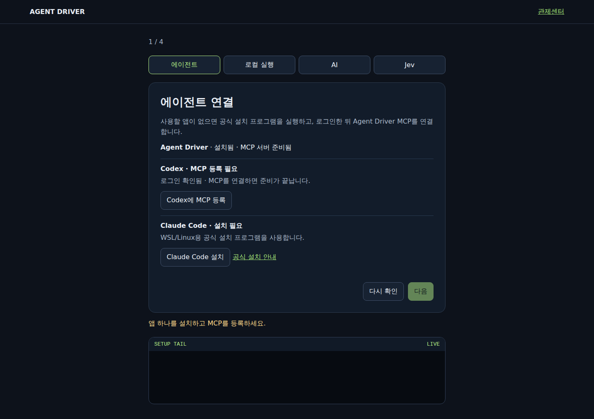
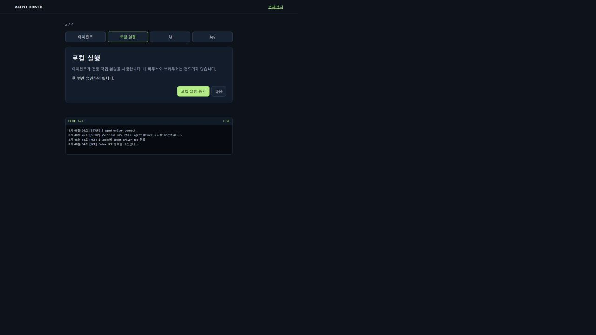
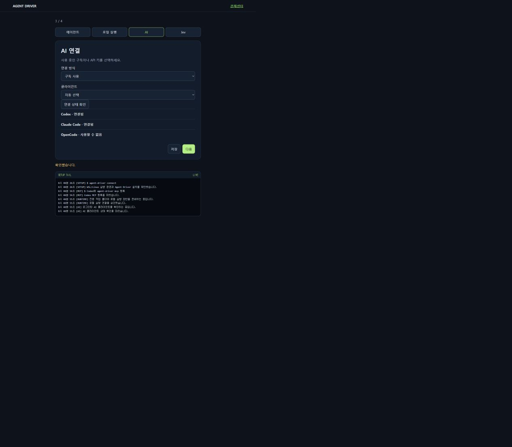
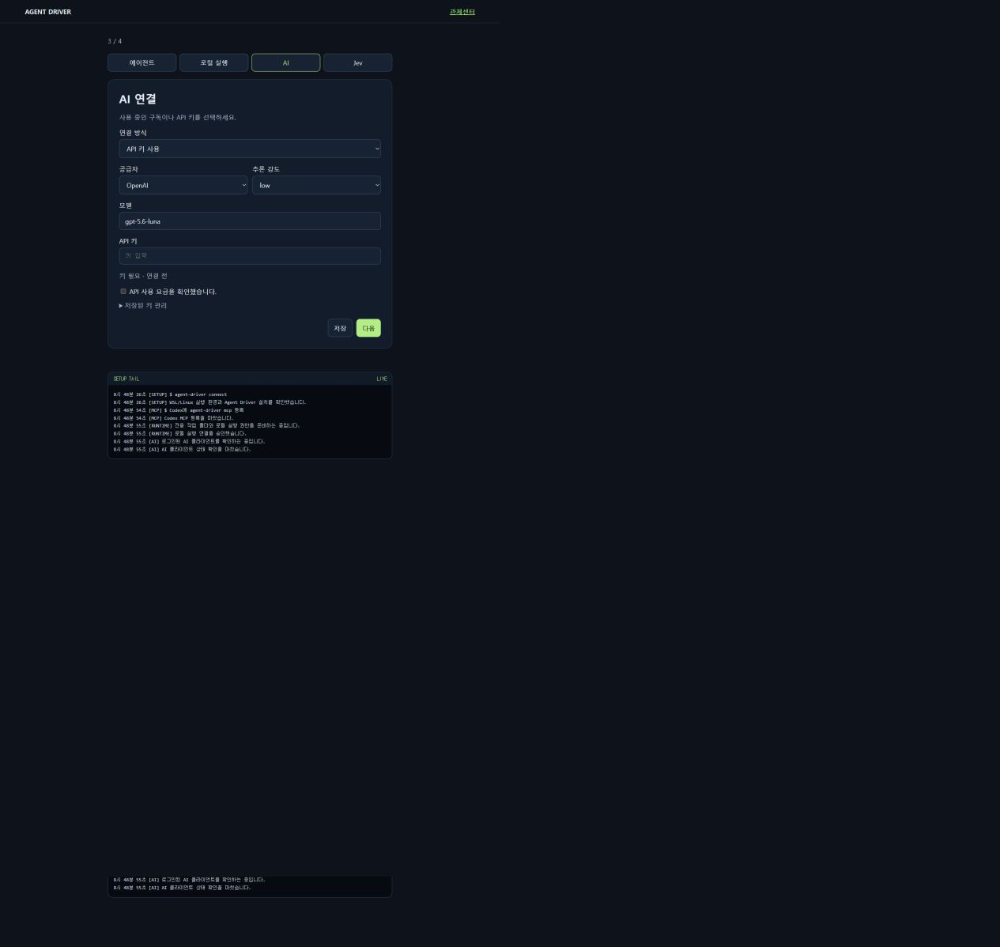
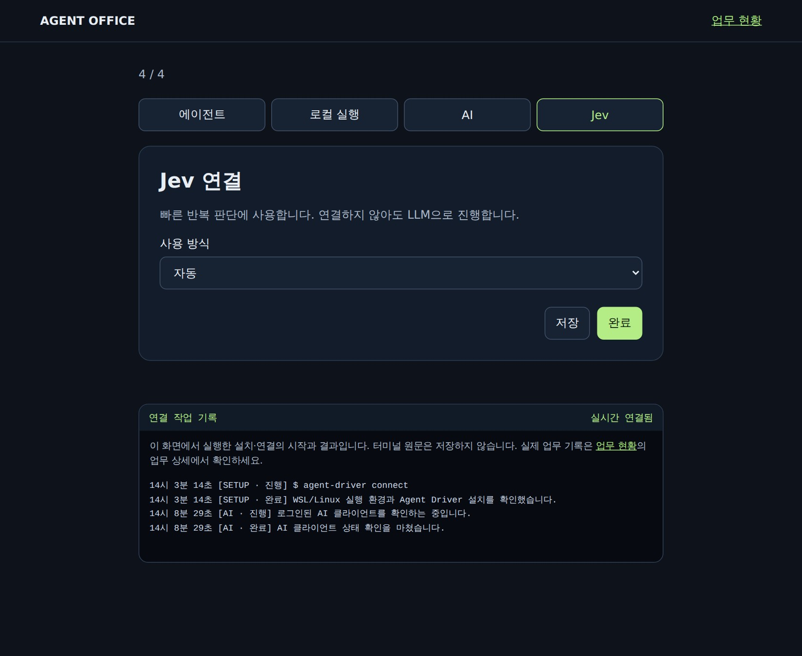

# Agent Driver

AI 에이전트에 전용 브라우저·CLI·파일 작업 도구와 실행 기록·승인·복구 기능을 제공하는 로컬 MCP 런타임.

Claude Code, Codex, Cursor, Hermes에서 웹 검색, 폼 입력, 파일 수집 같은 작업을 맡길 수 있습니다. 브라우저 작업은 전용 환경에서 진행하고, 실행 기록과 재개 정보는 로컬에 보관합니다.

Apache-2.0 오픈소스이며, 현재 공개 저장소의 `main`은 개발 alpha입니다. Ubuntu 24.04와 Windows의 WSL2 Ubuntu에서 개발·검증합니다. 기능별 실제 확인 범위와 남은 제약은 [출시 검증 기록](docs/release-readiness-alpha-18.md)에서 확인하세요.

## 시작하기

설치를 맡길 에이전트에게 다음과 같이 요청하세요.

> github.com/deepdivekr/agent-driver를 설치하고 MCP에 연결해줘. 앞으로 브라우저와 파일 작업에 Agent Driver를 사용해줘.

직접 설치하려면 Ubuntu 또는 WSL2 Ubuntu 터미널에서 한 번 실행합니다.

```bash
curl -fsSL https://raw.githubusercontent.com/deepdivekr/agent-driver/main/install.sh | bash
```

설치기는 사용자 홈 아래에 저장소와 전용 실행 환경을 만들고, Node.js **22.22.0** 배포물의 checksum을 확인한 뒤 npm **11.11.0**, 의존성, 빌드, Playwright Chromium, `agent-driver` 명령을 준비합니다. 기존 비관리 폴더, 심볼릭 링크, 수정된 설치본은 덮어쓰지 않습니다. 원격 스크립트를 먼저 검토하려면 [install.sh](install.sh)를 내려받아 확인한 뒤 실행하세요.

완료되면 관제센터가 자동으로 열립니다. 이후에는 관제센터 하나에서 다음 순서로 진행합니다.

1. 사용할 Codex·Claude Code·OpenCode·Cursor CLI·Hermes가 없으면 공식 설치를 실행합니다.
2. 설치된 클라이언트의 공식 로그인/Auth를 완료합니다.
3. 해당 클라이언트에 `agent-driver mcp`를 등록합니다.
4. 로컬 실행을 승인하고 구독 또는 API 모델, 선택적 Jev를 연결합니다.
5. 클라이언트나 Hermes에서 자연어로 Task를 요청합니다.

버튼을 누르면 하단 **SETUP TAIL**에 설치·인증·등록 단계만 표시되고 raw CLI 출력과 credential은 남기지 않습니다. 연결 정보는 기본적으로 `~/.agent-driver`에 저장됩니다. 사이트 로그인은 Task가 인증이 필요한 URL을 만났을 때만 해당 작업을 멈추고 요청합니다.

설치와 등록은 사용자가 버튼을 눌렀을 때만 시작합니다. 관리 설치는 공식 HTTPS 원본만 허용하지만 공급자 script의 checksum을 고정하지는 않습니다. 원격 설치 프로그램 실행을 원하지 않으면 화면의 공식 안내를 사용하세요. 자동 등록을 사용할 수 없는 클라이언트의 수동 명령은 다음과 같습니다.

```text
agent-driver mcp
```

JSON 설정을 사용하는 클라이언트에서는 아래와 같습니다.

```json
{
  "mcpServers": {
    "agent-driver": {
      "command": "agent-driver",
      "args": ["mcp"]
    }
  }
}
```

이 예시는 클라이언트와 서버가 같은 Ubuntu/WSL 환경에서 실행될 때 사용합니다. Windows 앱에서 연결할 때는 MCP 실행 명령을 WSL로 연결해야 합니다. 클라이언트에서 명령을 찾지 못하면 `command`에 실행 파일의 절대 경로를 지정하세요.

MCP에 연결하면 에이전트가 작업 도구를 호출할 수 있습니다. 사용할 사이트와 파일 경로의 접근 범위는 작업에 맞게 설정합니다. Jev API 키는 선택 사항입니다.

[첫 연결 안내](docs/first-run.md) · [MCP 설정과 도구](docs/agent-interface.md) · [Hermes·Telegram 연결](docs/hermes-telegram-runtime.md)

## 첫 연결

`agent-driver connect`를 실행하면 아래 네 단계가 한 화면에 하나씩 나타납니다.

### 1. 에이전트 설치·로그인·MCP

사용할 클라이언트가 없으면 설치하고, 공식 로그인을 완료한 뒤 `agent-driver mcp`를 등록합니다. 기존의 다른 MCP 설정은 유지합니다.



### 2. 로컬 실행

전용 작업 폴더와 로컬 실행 권한을 한 번 승인합니다. Agent Driver는 사용자 마우스와 브라우저를 조작하지 않습니다.



### 3. AI

이미 로그인한 클라이언트 구독을 사용하거나 API 키를 연결합니다.



- **구독:** MCP sampling, Codex, Claude Code, OpenCode
- **API:** OpenAI, Anthropic, OpenRouter, OpenAI 호환 서버

API 방식은 공급자·모델·키를 입력하고 연결 확인을 통과해야 저장됩니다.



### 4. Jev

Jev는 반복되는 짧은 판단을 빠르게 처리하는 선택 기능입니다. 키가 없으면 LLM이 그대로 판단하므로 건너뛰어도 됩니다.



사이트 로그인은 첫 설정에 포함되지 않습니다. Task가 로그인이 필요한 URL을 만났을 때 해당 worker가 멈추고 관제센터에 **사이트 로그인 필요**가 나타납니다.

## Muse·Grok Bot 같은 가상 컴퓨터 제품과의 차이

VM은 공통 기반일 뿐입니다. Muse와 Grok Bot은 공급자가 계속 켜 두는 클라우드 컴퓨터에 자체 채팅, 장기 기억, 알림, 승인, 다중 bot 운영을 묶은 완성형 서비스입니다. Agent Driver는 사용자가 소유한 로컬 실행 환경을 Codex·Claude·Cursor·Hermes 같은 여러 클라이언트에 공통 MCP로 연결합니다.

Agent Driver가 맡는 부분은 Task Pack 실행, LLM·Jev·코드 판단 분리, 중단 후 재개, 중복 효과 방지, 승인과 결과 증거입니다. 대화 기억은 연결한 클라이언트가 소유하며, 현재 호스트가 꺼지면 로컬 작업도 중단됩니다. 선택형 cloud worker와 관제센터 자체 Task 입력·결과함은 아직 제공하지 않습니다. [공식 자료 기반 비교](docs/product-comparison-2026-09-23.md)

## 어떤 작업에 쓰나요?

Task Pack은 작업의 입력, 실행 순서, 결과 확인 방법을 묶은 단위입니다. 아래 여덟 종류의 Pack family를 바탕으로 연결된 사이트와 데이터에 맞는 작업을 구성합니다.

| 작업 | 예시 | Pack family |
|---|---|---|
| 검색·비교 | 여러 출처를 조사하고 근거 링크와 함께 정리 | `research.search` |
| 조회·다운로드 | 로그인된 포털에서 기간별 자료 수집 | `portal.collect` |
| 폼 작성 | 신청서 초안을 채우고 제출 전 검토 | `form.draft-submit` |
| 정보 수정 | 기존 레코드를 읽고 승인받은 내용 반영 | `record.update` |
| 후보 선택 | 상품·옵션을 비교하고 장바구니에 담기 | `choose.stage` |
| 받은 편지 정리 | 메시지 분류와 답장 초안 작성 | `inbox.triage` |
| 변경 감시 | 가격·상태를 반복 확인하고 변경 기록 | `monitor.watch` |
| 파일 처리 | CSV·JSON 필터링, 변환, 병합 | `file.pipeline` |

각 사이트의 로그인과 실행 설정이 필요합니다. 검증된 작업 흐름은 다음 실행에서 재사용하며, 새 사이트에 대한 자동 적응은 실험 중입니다. 변경 알림의 외부 전송은 Hermes 같은 상위 에이전트가 담당합니다.

[Pack 목록과 지원 범위](docs/pack-catalog.md)

### 실제 실행 기록

공개 뉴스 수집 → 로컬 검색·CSV → Jev 분류 → 감시 상태 재연결 → 실제 연락 양식 미제출 초안까지 stdio MCP로 실행했습니다. 원본에서 6.743초, 공개 alpha.18 사본에서 10.959초에 6종 경로를 확인했습니다. 서로 다른 시점의 개별 기록이며 속도 비교나 8종 전체의 실서비스 쓰기·자연어 자율 실행 완료를 뜻하지 않습니다. [단계별 결과와 재실행 방법](docs/evaluation-live-alpha-18.md)

## 실행 방식

Swarm에서는 6개 사이트를 재관측하고, 종합 단계의 시간 초과를 복구해 3분 43.8초에 조사 메모를 완료했습니다. 기존 근거를 재검증한 실행이며 속도 비교 실험은 아닙니다. [실패와 복구, worker별 시간·토큰 기록](docs/evaluation-swarm-alpha-18.md)

클라이언트가 `agent-driver mcp`를 로컬 프로세스로 시작하고 작업을 요청합니다. Agent Driver는 전용 브라우저, CLI 세션, 허용된 파일 경로에서 실행하고 결과를 다시 읽어 확인합니다. 작업 상태는 로컬 SQLite에 저장해 중단 후 복구에 사용합니다.

| 역할 | 담당 |
|---|---|
| LLM | 요청 해석, 작업 계획, 처음 보는 상황 처리 |
| Jev — 선택 사항 | 화면 상태, 클릭 대상, 결과 품질, 다음 단계 판단 |
| 코드 | 클릭·입력·파일 처리, 승인 검사, 실행 결과 확인 |

Jev는 현재 상태와 후보를 받아 선택 결과와 확률을 반환합니다. 판단별 검증 기준을 통과한 결과를 실행에 사용하고, 불확실한 경우 LLM이 재검토합니다. 모델에 전달하는 관측 정보는 연결한 제공자의 API로 전송됩니다.

**Swarm Mode**에서는 LLM이 작업을 나누고, 클라이언트가 여러 sub-agent를 병렬 실행합니다. Agent Driver가 작업 배정, 진행 상태, 결과 검증을 관리합니다. 사용하려면 sub-agent 실행을 지원하는 클라이언트가 필요합니다.

[Swarm Mode](docs/swarm-mode.md) · [Jev 판단과 검증](docs/decision-plane.md) · [평가 결과](docs/evaluation-summary.md)

## 실행 환경과 현재 범위

- **지원 환경:** Ubuntu 24.04 / Linux x86_64, Windows + WSL2 Ubuntu. Native Windows·macOS 설치와 데스크톱 앱 제어는 미지원입니다.
- **브라우저:** Playwright Chromium을 사용합니다. 선택형 Ubuntu VM은 KVM·QEMU가 필요하며, VM 안에서 별도로 로그인합니다.
- **AI 연결:** MCP sampling이나 Codex·Claude Code·OpenCode 구독을 사용할 수 있습니다. API 방식은 OpenAI, Anthropic, OpenRouter 또는 구조화 출력을 지원하는 OpenAI 호환 서버를 연결할 수 있습니다.
- **외부 변경:** 폼 제출과 레코드 수정은 변경 내용을 확인한 사람의 승인을 거칩니다.
- **작업 한도:** 상품은 장바구니, 메시지는 초안까지입니다. 결제·예약 확정·주문·멤버십 가입·이메일 발송·삭제는 지원 범위 밖입니다.
- **격리:** 전용 브라우저와 VM은 작업 공간을 분리합니다. 악성 코드를 위한 보안 샌드박스로는 검증하지 않았습니다.
- **개인 계정:** 필요하면 전용 브라우저 프로필을 사용할 수 있습니다. 사이트별 이용 조건과 접근 방식은 사용자가 선택하며 Agent Driver가 특정 API를 강제하지 않습니다.

[Ubuntu VM 설정](docs/owned-ubuntu-browser-vm.md) · [CLI 지원 범위](docs/cli-adapter-matrix.md) · [복구 절차](docs/supervisor-recovery.md)

## 개발

저장소 루트의 Ubuntu/WSL 터미널에서 실행합니다.

```bash
npm ci
npm run test:runtime
```

`test:runtime`은 빠른 기본 회귀이며 장시간 soak를 포함하지 않습니다. 선택 검사도 같은 Ubuntu/WSL 저장소 루트에서 명시 실행합니다.

```bash
# 장시간 soak만 실행
npm run build && node scripts/runtime/run-tests.mjs soak
# soak를 포함한 전체 묶음
npm run build && node scripts/runtime/run-tests.mjs full
```

테스트는 실제 환경 검증과 테스트용 환경 검증을 구분해 기록합니다. 설계와 세부 계약은 [개발 문서](docs/control-plane-design-v0.7.md)를 참고하세요.

## 라이선스

[Apache License 2.0](LICENSE). 조건에 따라 수정·재배포·상업적 사용이 가능합니다. 외부 의존성은 각자의 라이선스를 따릅니다. [라이선스 범위](docs/licensing.md) · [외부 의존성 고지](THIRD_PARTY_NOTICES.md)
