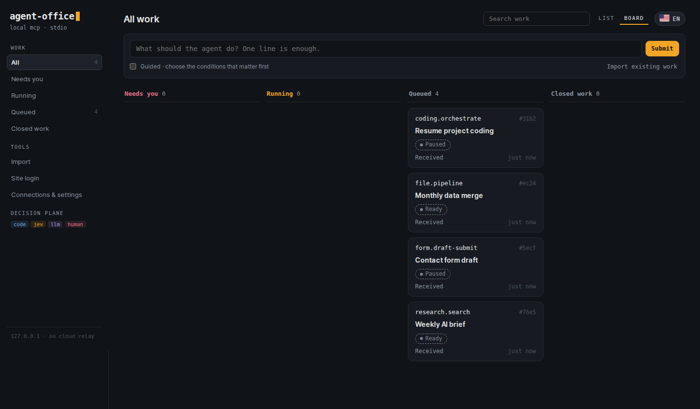
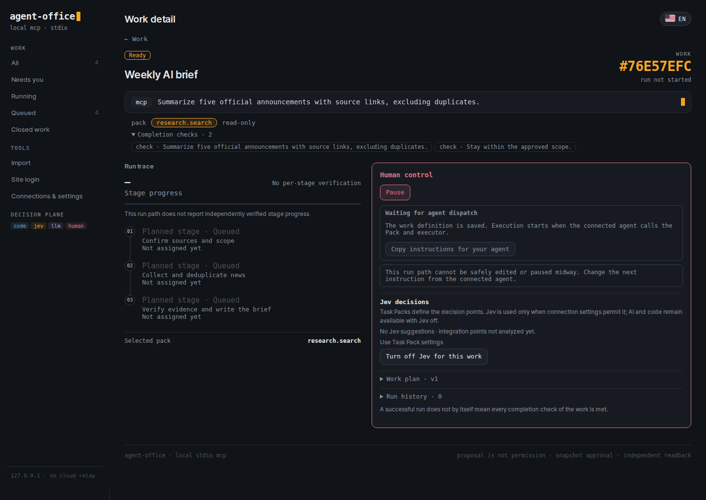
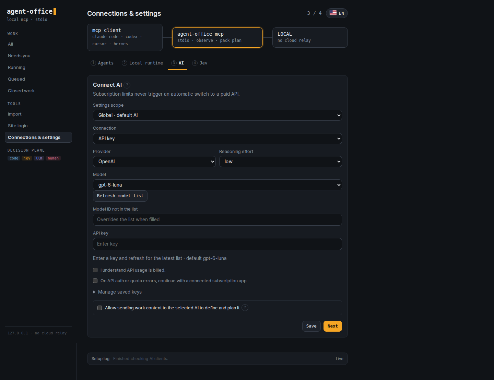

# Agent Office

**A local MCP server that helps AI agents run work on your computer and resume after interruptions.**

**English** · [한국어](README.ko.md) · [v0.3.1 release notes](docs/releases/v0.3.1.md)

Connect it to Codex, Claude Code, Cursor, OpenCode, Hermes, or another MCP client.
Install and run it as `agent-office`. The old `agent-driver` command remains a compatibility alias.

## A look inside

**Work board** — submit a request and see work grouped by status.



<details>
<summary>Work details and AI connection</summary>

**Work detail** — review the goal, completion checks, planned steps and execution handoff; pause before dispatch.



**AI connection** — choose a subscription client, API provider or compatible local endpoint.



</details>

Current interface in English and dark mode, with isolated sample work.
These screenshots show setup and queued work, not completed live-agent runs.

## Supported environments

| Environment | Status |
|---|---|
| Ubuntu 24.04 x86_64 | Browser, CLI, and file workflows |
| Windows 11 + WSL2 Ubuntu 24.04 | Runs the same Linux runtime |
| Native Windows desktop control | Experimental; executor and permission setup required |
| macOS | Installation and native operation not validated |

The default browser is a dedicated background Chromium. A VM is optional.
Out-of-the-box control of every desktop app is not supported.

## Get started

Ask your agent:

> Install github.com/deepdivekr/agent-office and connect it over MCP. Use Agent Office for my browser and file work.

Or run this from **Ubuntu or WSL Ubuntu**, in any directory:

```bash
bash -o pipefail -c 'curl -fsSL https://raw.githubusercontent.com/deepdivekr/agent-office/v0.3.1/install.sh | bash'
```

You can [review the installer](install.sh) first.
It prepares a dedicated Node.js, dependencies, and Chromium, then opens the Control Center.
Missing system libraries produce setup instructions; the installer does not run privileged commands automatically.

### Connect in the Control Center

1. **Clients** — check installation and login, then register MCP.
2. **Execution** — use the default browser or connect an optional executor.
3. **AI** — choose a subscription CLI or API. Compatible local models are also supported.
4. **First Work** — enter one request and follow its progress.

Jev is optional. Without it, the LLM and code handle decisions.
Website login is requested when a task needs it.

Aside and Neo require their own installation and running application.
Check and register them in the Control Center. Leave them unconnected to use Playwright.
Fallback stays within the authorized environment. [Browser setup](docs/browser-executor-setup.md)

To reopen the Control Center, run this in the same Ubuntu environment:

```bash
~/.local/bin/agent-office connect
```

For manual MCP registration, use `agent-office mcp`.
Windows clients should use the WSL command shown in the Control Center.
[First-run guide](docs/first-run.md) · [MCP configuration](docs/agent-interface.md)

## What can I ask it to do?

> Research three companies' official announcements and make a comparison table with sources.

> Fill out this inquiry form. Stop before submitting it.

> Resume this project's coding work, then have another CLI review the changes.

A **Work** holds your request, completion checks, progress, and run history.
Its detail page shows why it stopped and who took over. Pause it, change instructions, and resume.

The nine built-in **Pack families** provide reusable workflow patterns.

| Family | Examples |
|---|---|
| Search | Research and source comparison |
| Portal collection | Queries and downloads |
| Form drafting and submission | Applications and inquiry forms |
| Record updates | Changes to existing entries |
| Inbox triage | Message and request classification |
| Monitoring | Change checks and alerts |
| File pipelines | Organization, conversion, and merging |
| Candidate selection | Comparisons and staging |
| Coding orchestration | CLI instructions and result review |

You do not need to write a Pack first.
The LLM structures the request; verified procedures can be reused.
Changed pages or environments require fresh checks. Repeat runs are not guaranteed to be faster.

## How does work continue?

- **LLM**: planning, unfamiliar situations, and replanning.
- **Jev (optional)**: short, typed decisions defined by the Pack.
- **Code and executors**: browser, CLI, and file actions with result verification.
- **Runtime**: checkpoints, approvals, and handoff records. Uncertain writes are not blindly replayed.

An exhausted AI connection can hand work to another permitted connection.
**Subscription usage never automatically falls back to a paid API.**
API-to-subscription handoff also follows the configured connections and policy.

Use **Import** to connect existing work. Hermes and remote OpenClaw can keep their original runtime.
Importing alone does not start work or activate schedules.
[Work import](docs/work-migration.md) · [Remote management](docs/remote-office.md)

## Updates and limits

Finish active work, disconnect MCP clients, and close the Control Center before rerunning the installer.
If the shared server is still running, follow the [stop and reconnect guide](docs/mcp-resource-lifecycle.md).
New installs use `~/.local/share/agent-office` and keep settings and Work data in `~/.agent-office`.
Existing `~/.agent-driver` data is reused in place; old installations are not deleted.
Installations with private workflow code need a [compatibility review](docs/local-workflow-compatibility.md).

- Aside and Neo adapters are currently **read-only**. Form writes and guest-VM transports are not supported.
- People handle authentication, CAPTCHAs, and approvals.
- Queued Work does not allocate a VM per task. Active browsers and model CLIs consume additional resources.
- Keep local connection tokens, API keys, and private workflow data out of shared files.

[Release validation](docs/release-readiness-v0.3.1.md) · [AI settings](docs/control-settings.md) · [Browser routing](docs/browser-executor-routing.md) · [Memory and process lifecycle](docs/mcp-resource-lifecycle.md)

## Development and license

```bash
git clone https://github.com/deepdivekr/agent-office.git
cd agent-office
npm ci
npm test
```

Use Node.js **22.22.0** and npm **11.11.0**.
The default test suite excludes long soak tests.

[Apache License 2.0](LICENSE). Connected models, browsers, and services have their own licenses and terms.
