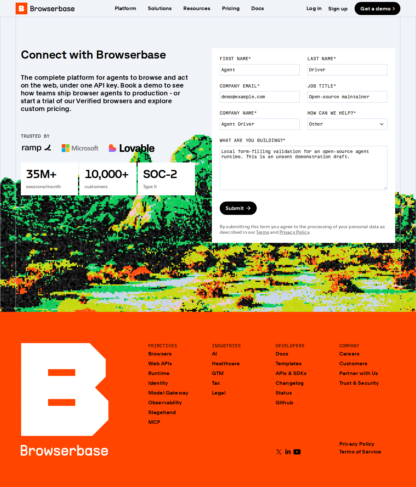

# alpha.18 실제 실행: 공개 뉴스 수집에서 폼 초안까지

2026-09-23 05:13:54 UTC에 Ubuntu/WSL 환경에서 수행했습니다. 테스트용 웹 서버를 만들지 않고, 공개 Hacker News와 Browserbase 페이지에 접근했습니다. 모든 Pack 실행·상태 조회는 별도 프로세스로 시작한 Agent Driver의 **stdio MCP** 도구를 통해 수행했습니다.

전체 경과 시간은 **6,743ms**였습니다. 단일 실행 기록이며 평균·백분위·다른 에이전트 대비 속도 우위는 측정하지 않았습니다. 각 단계의 시간은 아래와 같습니다.

| Pack family | 실제 수행 | MCP 호출 시간 | 확인한 결과 |
|---|---|---:|---|
| `portal.collect` | Hacker News 공개 목록 수집·JSON 저장 | 1,328ms | 30행, 저장 파일 hash 재확인 |
| `research.search` | 위에서 저장한 실제 제목에서 `AI` 검색 | 17ms | 5건 |
| `file.pipeline` | 같은 자료를 CSV로 변환 | 18ms | 30행, 출력 재확인 |
| `monitor.watch` | 공개 목록 재조회·감시 기준값 저장 | 1,095ms | MCP 재시작 뒤 `watching` 유지, 확인 후 일시정지 |
| `inbox.triage` | 실제 제목 1건 분류·답장 초안 선택 | 679ms | Jev `ai`, 반환 `confidence` 0.96, 외부 발송 0 |
| `form.draft-submit` | Browserbase 연락 양식 7개 필드 입력 | 2,488ms | `draft_ready`, 제출 경로 `PACK_DRAFT_ONLY` 차단 |

Jev 호출 자체는 **648ms**였습니다. 0.96은 해당 호출의 `confidence`이며 선택지 확률 분포의 집중도를 나타냅니다. 통계적 p-value, 정답일 확률 또는 실제 정확도·보정 완료를 뜻하지 않습니다. 검색·파일 변환·폼 입력 단계는 코드가 수행했습니다.

같은 수집 요청을 다시 보냈을 때 기존 `run_id`가 반환되는 중복 방지도 확인했습니다. 전체 시간에는 위 호출 외에 MCP 시작·재연결과 검증 시간이 포함됩니다.

## 공개 패키지 재확인

원본 회귀 438/438과 clean 공개판 회귀 415/415를 마친 뒤, 공개 alpha.18 사본 자체에서도 같은 실제 stdio MCP 경로를 다시 실행했습니다. 2026-09-23 05:45:54 UTC 완료, **10,959ms**, 뉴스 30행·검색 6건·CSV 30행, Jev 분류 1건(confidence 0.93, 호출 874ms), 미제출 폼 7개 필드(4,254ms), 감시 재시작 지속성·중복 방지 모두 확인했습니다.

두 실행 사이에 뉴스 목록과 로딩 시간이 달라졌습니다. 6.743초와 10.959초는 개별 실행 기록이며, 통제된 속도 비교나 성능 보장으로 해석하지 않습니다. 두 번째 실행은 아래 공개 JSON의 `public_projection_recheck`에 별도로 남겼습니다.

## 제출하지 않은 실제 폼

입력값은 `Agent Driver`, `demo@example.com` 등 데모용 정보입니다. 제출 버튼을 누르지 않았고, 승인 실행 도구로 제출하려는 시도도 `PACK_DRAFT_ONLY`로 거부됐습니다.



초안 전용 모드는 폼 제출을 가로막고 비읽기 HTTP 요청을 차단합니다. 이 제한이 임의 사이트 전체를 대상으로 외부 효과가 전혀 없음을 보장하는 보안 샌드박스라는 뜻은 아닙니다.

## 이 실행으로 검증하지 않은 것

- 8종 중 **6종의 해당 실행 경로**를 확인했습니다. `record.update`와 `choose.stage`의 실서비스 변경은 수행하지 않았습니다.
- 수집 대상은 로그인 없는 공개 페이지입니다. 인증된 포털 수집은 이번 검증에 포함하지 않았습니다.
- 감시는 기준값의 재시작 지속성만 확인했습니다. 실제 변경 이벤트와 외부 알림은 실행하지 않았습니다.
- `inbox.triage`는 제목 1건입니다. 메일 계정 연결, 대량 분류 정확도 평가, 메시지 전송이 아닙니다.
- `research.search`는 이미 수집한 로컬 자료 검색입니다. 전 웹 검색이나 새로운 사이트 자동 발견을 측정하지 않았습니다.
- 검증 스크립트가 연결과 recipe를 명시했습니다. `runtime_pack_plan`의 응답은 `needs_agent_design`이었습니다. 한 줄 자연어에서 자동 설계·실행까지 완료한 벤치마크가 아닙니다.
- 실행 기록의 `environment: production`은 fixture가 아닌 설정 모드이며, 운영 안정성 인증이 아닙니다.
- 이 기록은 정상 실사례입니다. 장애 복구·승인·중복 외부 효과에 대한 회귀 검사와 구분합니다.

## 증거와 재실행

[공개용 실행 요약 JSON](evidence/live-families-alpha18.json)에는 개인 경로, 인증 정보, 원문 전체, 원시 모델 응답을 포함하지 않습니다. 원시 실행 기록은 비공개로 보존합니다.

아래 명령은 **Ubuntu/WSL의 이 저장소 루트**에서 실행합니다. 실제 외부 사이트에 접속하고, 출력은 `.runtime`에 새로 저장합니다. 외부 폼 제출이나 알림 전송은 하지 않습니다. 사이트 구조와 당시 목록에 따라 결과·시간은 달라집니다.

```bash
npm ci
npm run build
npx playwright install chromium
node scripts/live-family-validation.mjs
```

`TYPESAFE_API_KEY`가 현재 환경에 설정돼 있으면 Jev로 제목을 분류합니다. 설정하지 않으면 모델 없이 실행하며 분류가 `needs_review`/미확인으로 남을 수 있습니다. 키를 명령줄 인자나 공개 로그에 넣지 마세요. 의존성 설치, 모델 호출과 실제 사이트 접근에는 별도 네트워크가 필요합니다.
